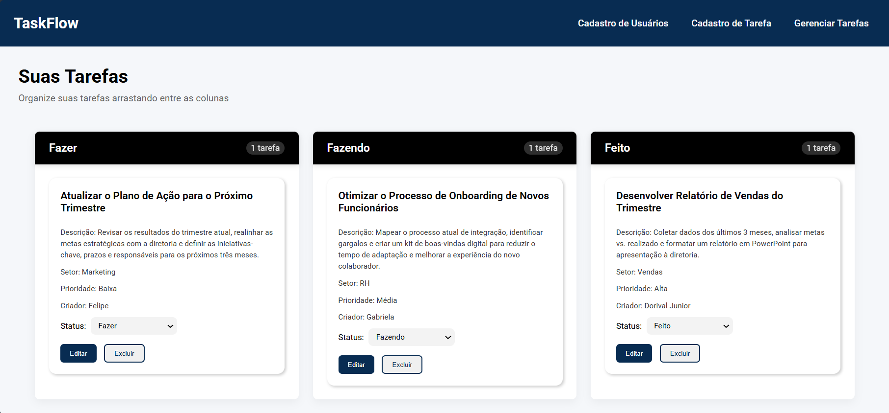

# 🗂️ TaskFlow

TaskFlow is an academic **Kanban-style** task management project.  
During development, I worked on fundamental aspects such as **form validation** and **accessibility features implementation**, ensuring an inclusive and efficient user experience.  

I also learned to **test my code** to guarantee **quality** and proper application functionality.

## Main Screen



## Technologies Used

<div style="display: flex; gap: 10px; align-items: center;">
  
  
  
</div>

## Main Features
- Task organization in **Kanban-style** columns
- **Form validation** to ensure data integrity
- **Enhanced accessibility** with semantic tags and ARIA attributes
- Intuitive interface

## ⚙️ How to Run the Project

```bash
# Clone the repository
git clone https://github.com/jokita06/TaskFlow.git

# Access the project folder
cd taskflow

# Install frontend dependencies
cd client
npm install

## Start React server
npm run dev

# In another terminal, access the backend
cd server

## Create a virtual environment
python -m venv env

## Install dependencies
pip install -r requirements.txt

# Start Django server
python manage.py runserver
